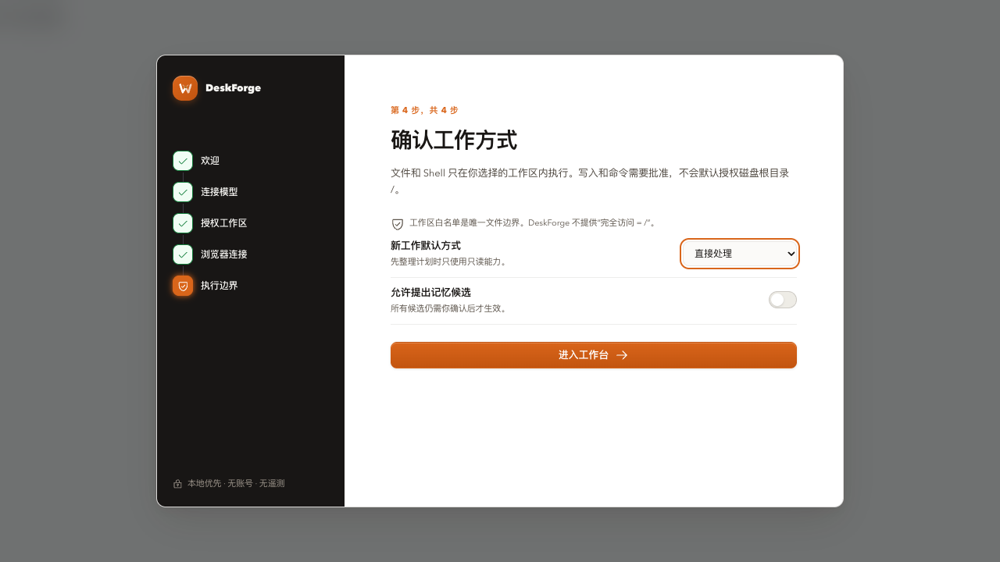
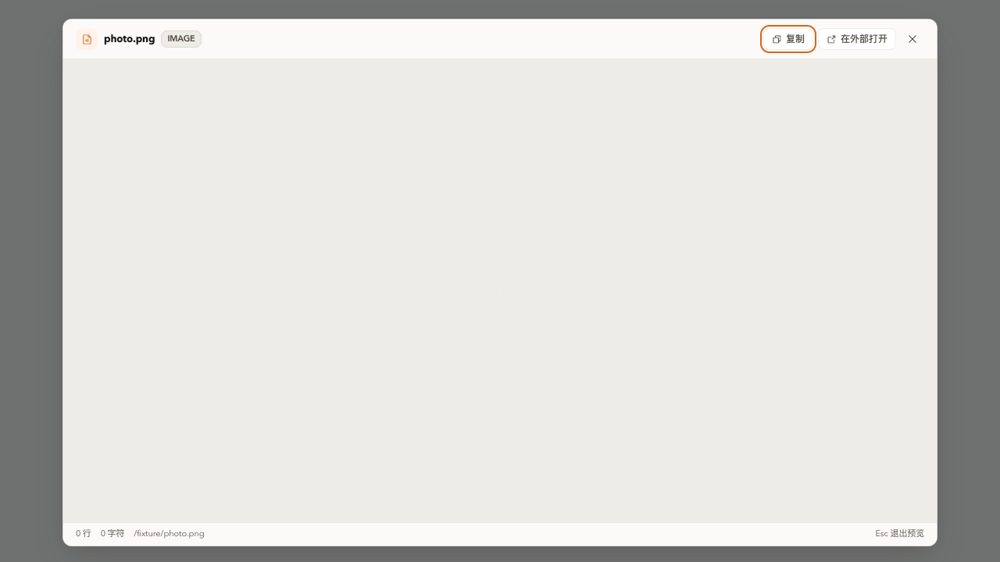

# 本地版本审查修复

日期：2026-10-08。基线为用户当前本地提交 4df606a，保留既有功能；以下是针对 PR #6 的增量修复，不回退本地版本。

## 根因与修复

- P1：引导关闭前后的 Hook 数量不同。Onboarding 的 ref 与焦点约束 Hook 移到提前返回之前，保证每次渲染都调用。
- P2：renderer bridge 的 2 MB 默认参数覆盖主进程的 10 MB 图片默认值。未显式传入时不发送 maxBytes，保留主进程按 MIME 分配限制；显式限制仍保留。图片截断提示也修正为 10 MB。
- CI：Linux smoke 启动因 chrome-sandbox 的所有者/4755 权限不正确退出。只在 CI 为安装的 Electron helper 设置正确权限；不关闭产品 sandbox。

## 回归证据

使用真实 Onboarding、DocumentPreviewModal 与 renderer bridge，在浏览器中通过假 IPC 和假资料隔离系统文件/模型。修复前：引导完成测试及 3 MB 图片测试失败，11 MB 限制通过。修复后：三项通过；引导可以完成并重新打开，3 MB 图片可显示，11 MB 图片仍受限。

命令：pnpm --filter @deskforge/desktop test:review。测试服务绑定本地地址。截图使用假资料，不包含用户数据。

## 本地检查

pnpm lint（0 errors，4 条既有 warnings）、pnpm typecheck、pnpm test（453 passed，1 skipped）、npm --prefix independent test（24 passed）、test:review（3 passed）、pnpm build、pnpm check:size、git diff --check。

Linux CI 的 sandbox 修复须由 GitHub Actions 实际运行验证；本地 macOS 回归不能替代 Linux smoke。
